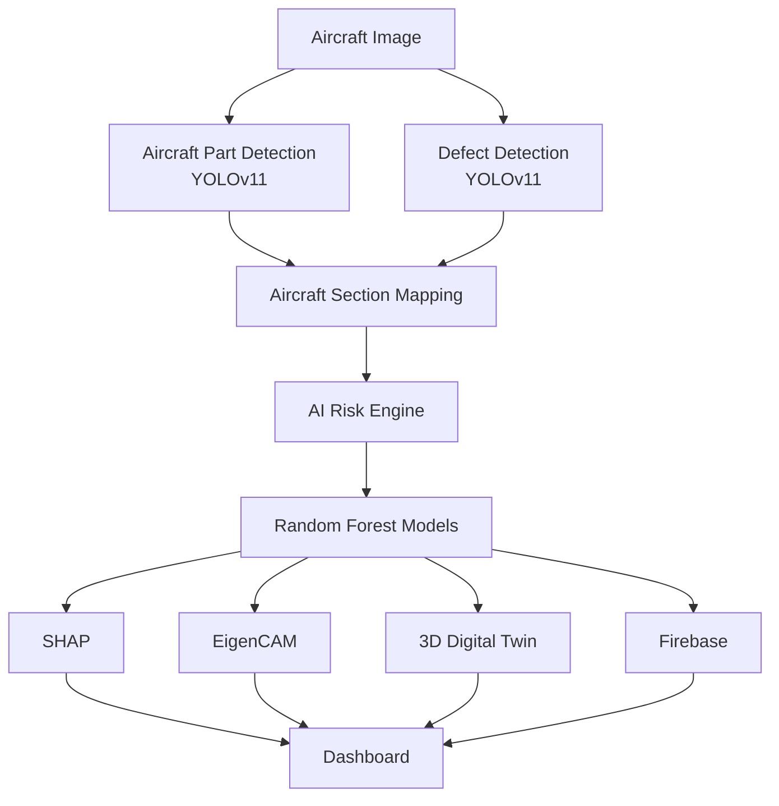

<div align="center">

# ✈️ DRISHTI

### AI-Powered Aircraft Health Twin

Transforming Aircraft Inspection with Computer Vision, Explainable AI, Predictive Maintenance and Interactive Digital Twins.


<br>


</div>

## Overview

Aircraft inspections remain one of the most critical yet time-intensive processes in aviation maintenance. Conventional inspections rely heavily on manual visual assessment, making them susceptible to inconsistencies, delayed maintenance decisions, and increased operational downtime.

DRISHTI is an AI-powered Aircraft Health Twin that transforms inspection images into intelligent maintenance insights through Computer Vision, Explainable AI, Predictive Analytics, and an Interactive 3D Digital Twin.

Rather than simply detecting defects, DRISHTI assists maintenance engineers by predicting aircraft health, estimating maintenance costs, explaining AI decisions, and visualizing structural damage directly on a live 3D aircraft model.
# 🚀 Features

- ✈️ Aircraft Part Detection using YOLOv11
- 🔍 Surface Defect Detection (Crack, Dent, Corrosion)
- 📍 Automatic Aircraft Section Mapping
- 🧠 Predictive Maintenance using Random Forest Models
- 📈 Future Risk Prediction
- ⚠️ Failure Probability Estimation
- ❤️ Aircraft Health Score
- ⏳ Remaining Useful Health Prediction
- 💰 Maintenance Cost Estimation
- 🚨 Maintenance Urgency Classification
- 🔥 Explainable AI using EigenCAM
- 🧩 SHAP Feature Explanations
- 🌍 Interactive 3D Aircraft Digital Twin
- 📊 Historical Trend Analysis
- ☁️ Firebase Inspection History


# 🏗️ System Architecture




# 🤖 AI Pipeline

```text
Aircraft Inspection Image
            │
            ▼
Aircraft Part Detection (YOLOv11)
            │
            ▼
Defect Detection (YOLOv11)
            │
            ▼
Bounding Box Extraction
            │
            ▼
Aircraft Section Mapping
            │
            ▼
────────────────────────────────────

Random Forest AI Engine

• Future Risk
• Failure Probability
• Health Score
• Remaining Useful Health
• Maintenance Cost
• Maintenance Urgency

────────────────────────────────────

            │
            ▼

Explainable AI

• EigenCAM
• SHAP

            │
            ▼

Interactive 3D Aircraft Twin

            │
            ▼

Maintenance Dashboard
```

# 📂 Project Structure

```text
DRISHTI
│
├── backend
│   ├── models
│   │   ├── best.pt
│   │   ├── parts_best.pt
│   │   ├── risk_model.pkl
│   │   ├── failure_model.pkl
│   │   ├── health_model.pkl
│   │   ├── cost_model.pkl
│   │   ├── ruh_model.pkl
│   │   └── urgency_model.pkl
│   │
│   ├── python
│   │   ├── core
│   │   ├── firebase
│   │   ├── scripts
│   │   ├── xai
│   │   └── outputs
│   │
│   ├── routes
│   ├── uploads
│   └── server.js
│
├── frontend
│   ├── src
│   │   ├── components
│   │   ├── pages
│   │   ├── hooks
│   │   ├── assets
│   │   └── utils
│   │
│   └── public
│
└── README.md
```

# 🧠 AI Models

DRISHTI combines multiple AI models to perform intelligent aircraft inspection and predictive maintenance.

| Model | Purpose |
|--------|----------|
| YOLOv11 (Aircraft Parts) | Detects aircraft structural components |
| YOLOv11 (Defect Detection) | Detects cracks, dents and corrosion |
| Random Forest Regressor | Predicts Future Risk |
| Random Forest Regressor | Predicts Failure Probability |
| Random Forest Regressor | Predicts Remaining Useful Health |
| Random Forest Regressor | Predicts Aircraft Health Score |
| Random Forest Regressor | Predicts Maintenance Cost |
| Random Forest Classifier | Predicts Maintenance Urgency |
| EigenCAM | Generates visual explanations |
| SHAP | Explains feature importance |

# 📊 Prediction Outputs

After analyzing an inspection image, DRISHTI generates comprehensive maintenance intelligence.

| Metric | Description |
|---------|-------------|
| Future Risk | Probability of future structural degradation |
| Failure Probability | Estimated likelihood of component failure |
| Health Score | Overall aircraft structural health |
| Remaining Useful Health | Estimated usable structural life |
| Maintenance Cost | Predicted repair expenditure |
| Maintenance Urgency | AI-generated maintenance priority |
| Risk Category | Criticality classification |
| Recommendation | Suggested maintenance action |
| Aircraft Status | Current structural condition |
| Trend Analysis | Historical defect progression |


# 🔍 Explainable AI

DRISHTI incorporates Explainable AI at two different stages of the pipeline to improve transparency and engineer trust.

## EigenCAM

EigenCAM explains the Computer Vision model by highlighting the image regions responsible for defect detection.

```text
Aircraft Image
        │
        ▼
YOLOv11
        │
        ▼
Activation Maps
        │
        ▼
EigenCAM Heatmap
        │
        ▼
Overlay on Inspection Image
```

## SHAP

SHAP explains the Machine Learning predictions by identifying the contribution of every input feature.

```text
Input Features

Defect Area
Growth Rate
Occurrences
Confidence
Location
Defect Type

        │
        ▼

Random Forest

        │
        ▼

SHAP Feature Importance

        │
        ▼

AI Explanation
```


# 🌍 Digital Twin

The Digital Twin provides an interactive visualization of detected defects on a realistic 3D aircraft model.

```text
Inspection Image
        │
        ▼
Defect Detection
        │
        ▼
Aircraft Section Mapping
        │
        ▼
3D Coordinate Mapping
        │
        ▼
Three.js Aircraft Model
        │
        ▼
Interactive Defect Marker
```

### Features

- Real-time defect visualization
- Interactive aircraft navigation
- Dynamic severity markers
- Structural location mapping
- Maintenance decision support

# 📈 Historical Trend Analysis

Every inspection is stored in Firebase Firestore, allowing DRISHTI to monitor structural degradation across multiple inspection cycles.

```text
Inspection 1
      │
Inspection 2
      │
Inspection 3
      │
Inspection 4
      │
      ▼
Trend Analysis
      │
      ▼
Growth Rate
      │
      ▼
Future Risk Prediction
```

Historical analysis enables:

- Defect recurrence tracking
- Growth rate estimation
- Remaining Useful Health prediction
- Predictive maintenance scheduling

# 📸 Dashboard Preview

## Home Dashboard

<p align="center">


</p>

Monitor aircraft health, visualize structural defects, analyze inspection history, and access AI-powered maintenance insights from a unified dashboard.

---

## Interactive 3D Digital Twin

<p align="center">


</p>

Every detected defect is automatically mapped onto the aircraft's 3D model, enabling intuitive structural visualization and rapid maintenance planning.

---

## Explainable AI

<p align="center">


</p>

EigenCAM highlights the image regions responsible for detection, while SHAP explains the reasoning behind every machine learning prediction.

# ⚙️ Installation

## Clone Repository

```bash
git clone https://github.com/<username>/DRISHTI.git

cd DRISHTI
```

## Backend

```bash
cd backend

npm install

pip install -r requirements.txt
```

## Frontend

```bash
cd frontend

npm install
```

## Start Backend

```bash
npm start
```

## Start Frontend

```bash
npm run dev
```

# 🚀 Usage

1. Upload one or more aircraft inspection images.

2. Select the corresponding aircraft section.

3. Run AI analysis.

4. DRISHTI automatically

   - Detects aircraft components
   - Detects structural defects
   - Maps defects to aircraft sections
   - Predicts maintenance metrics
   - Generates EigenCAM heatmaps
   - Computes SHAP explanations
   - Updates inspection history
   - Displays the interactive 3D Digital Twin

5. Review maintenance recommendations and AI explanations.

# 🌐 REST API

## Analyze Aircraft Images

```http
POST /api/analyze
```

### Request

```text
multipart/form-data

images[]
locations[]
aircraftId
```

### Response

```json
{
  "class": "crack",
  "location": "Fuselage",
  "confidence": 0.91,
  "futureRisk": 87.4,
  "failureProbability": 82.3,
  "healthScore": 18.2,
  "remainingUsefulHealth": 15,
  "maintenanceCost": 16400,
  "urgency": 100,
  "recommendation": "Detailed Crack Assessment",
  "heatmap": "...",
  "overlay": "...",
  "aiFactors": []
}
```


# 📊 Performance

| Component | Technology |
|-----------|------------|
| Aircraft Part Detection | YOLOv11 |
| Defect Detection | YOLOv11 |
| Risk Prediction | Random Forest |
| Failure Prediction | Random Forest |
| Health Score Prediction | Random Forest |
| RUH Prediction | Random Forest |
| Maintenance Cost Prediction | Random Forest |
| Maintenance Urgency | Random Forest |
| Explainability | SHAP + EigenCAM |
| Database | Firebase Firestore |
| Digital Twin | Three.js |


# 🔮 Roadmap

## Completed

- ✅ Aircraft Part Detection
- ✅ Surface Defect Detection
- ✅ Explainable AI
- ✅ Random Forest Risk Prediction
- ✅ Remaining Useful Health Prediction
- ✅ Maintenance Cost Prediction
- ✅ Failure Probability Prediction
- ✅ Interactive 3D Digital Twin
- ✅ Historical Trend Analysis
- ✅ Firebase Integration

## Future Enhancements

- ⬜ Drone-based autonomous inspections
- ⬜ Live video defect detection
- ⬜ Edge deployment on NVIDIA Jetson
- ⬜ Multi-aircraft fleet analytics
- ⬜ Predictive maintenance scheduling
- ⬜ Large Language Model maintenance assistant
- ⬜ Voice-enabled inspection reports
- ⬜ Augmented Reality maintenance guidance

# 🛠️ Built With

| Category | Technologies |
|----------|--------------|
| Programming | Python, JavaScript |
| Computer Vision | YOLOv11, OpenCV |
| Machine Learning | Scikit-learn, Random Forest |
| Explainable AI | EigenCAM, SHAP |
| Frontend | React, Vite, Tailwind CSS |
| 3D Graphics | Three.js, React Three Fiber |
| Backend | Node.js, Express |
| Database | Firebase Firestore |
| Deployment | Node.js Child Process Integration |


# 👥 Team

Developed by the DRISHTI Team.

Contributors

- AI & Machine Learning
- Computer Vision
- Explainable AI
- Backend Development
- Frontend Development
- 3D Visualization

# 📚 References

1. Ultralytics YOLOv11 Documentation
2. SHAP (SHapley Additive Explanations)
3. EigenCAM for Explainable Computer Vision
4. Three.js Documentation
5. Firebase Firestore Documentation
6. Scikit-learn Machine Learning Library

<div align="center">

## ✈️ DRISHTI

### Seeing Beyond Detection. Predicting the Future of Aircraft Health.

Built with ❤️ using AI, Explainable AI, Machine Learning, and Interactive Digital Twins.

</div>
